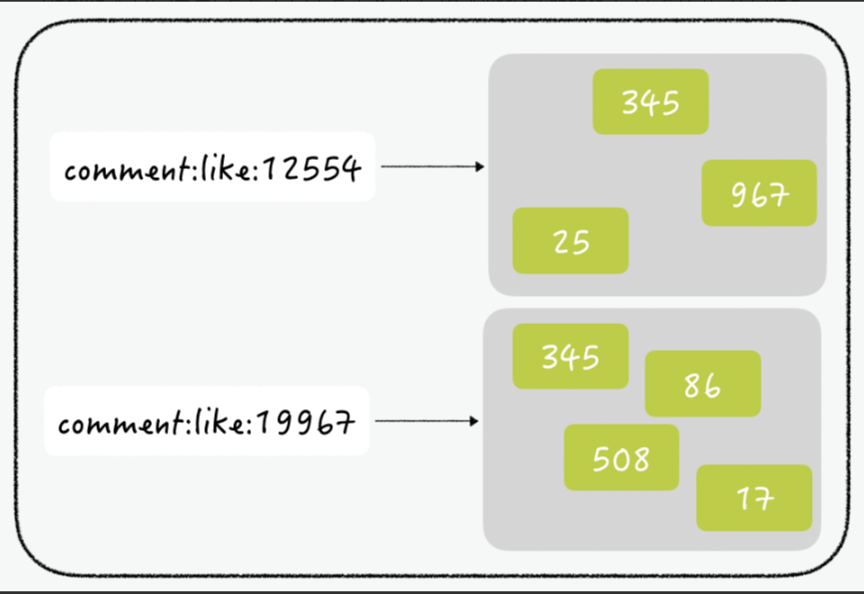
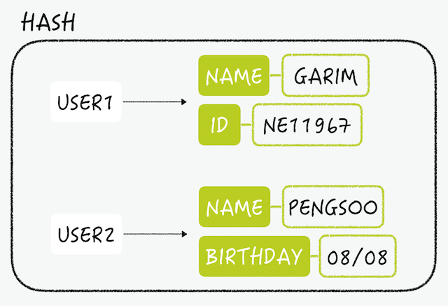
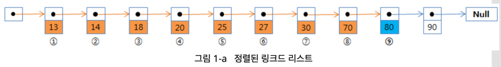
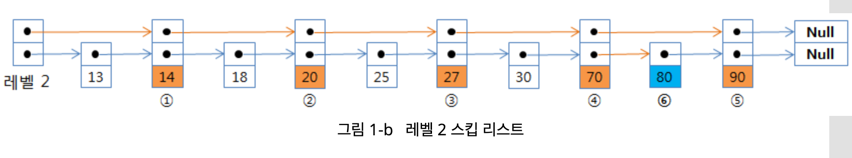
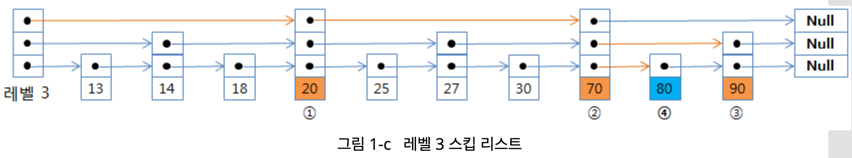

# DATA-STRUCTURE
- Redis의 장점 중 하나는 Key-Value 스토리지에서 Value는 단순한 Object가 아닌 다양한 자료구조를 갖는다는 점이다.

## Strings
- 값은 최대 512 MB이며 String으로 될 수 있는 binary data, JPEG 이미지, HTML Fragment도 저장 가능하다.
- 단순 증감 연산에 사용하기 좋다.


```
127.0.0.1:6379> set hello world
OK
127.0.0.1:6379> get hello
"world"
```

### Command
- set 명령어를 이용하여 key - value를 저장한다.
- get 명령어를 이용하여 key에 해당하는 value를 조회한다.
- del 명령어를 이용하여 key를 삭제한다.

### SETNX
- SET if Not eXist 의 줄임말으로, 키가 존재하지 않을 경우 값을 set하는 명령어
- Lettuce는 분산락을 구현할 때, 이 명령어를 이용해 Redis에게 락이 해제되었는지 요청을 보내는 스핀락 방식으로 동작한다.

```java
        while (true) {
            if (!lock(key)) {
                try {
                    log.info("락 획득 실패");
                    Thread.sleep(100);
                } catch (InterruptedException e) {
                    Thread.currentThread().interrupt();
                    throw new CustomException(ErrorType.FAILED_TO_ACQUIRE_LOCK);
                }
            } else {
                log.info("락 획득 성공, lock number : {}", key);
                break;
            }
        }
        try {
            return task.get();
        } finally {
            // Lock 해제
            unlock(key);
        }
```

## Lists
- 순서가 유지되고 중복을 허용하는 문자열 모음
- Linked List로 구현되어 있다. 따라서, 추가 / 삭제 / 조회는 O(1), 특정 index 값을 조회할 때는 O(N)
- Pub-Sub(생산자-소비자) 패턴으로 활용할 수 있다.
  - 생산자가 아이템을 만들어서 list에 넣으면 소비자가 꺼내와서 액션을 수행하는 식으로 동작
  - LPUSH + RPOP

### RPUSHX
- 트위터에서는 각 타임라인에 보여줄 트윗을 캐싱하기 위해 Redis의 List를 사용하는 데 **RPUSHX** 커맨드를 사용한다. 
  - RPUSHX는 키가 이미 있을 때에만 데이터를 저장한다. 이를 이용하여 이미 캐시된(이미 키가 존재하는) 타임라인에만 데이터를 추가할 수 있다.
  - 따라서 트위터를 자주 이용하는 유저의 타임라인에만 새로운 데이터를 캐시해놓을 수 있으며 자주 사용하지 않는 유저는 캐시에 키가 존재하지 않기 때문에 효율적으로 저장공간을 관리할 수 있다.

    
## Sets
- 중복된 데이터를 담지 않기 위해 사용하는 자료구조
- Key 값은 Unique하며 정렬 X
- Set간의 연산을 지원. 교집합, 합집합, 차이를 매우 빠른 시간내에 추출할 수 있다.
- 모든 데이터를 전부 다 갖고올 수 있는 명령(smembers)이 있으므로 주의해서 사용해야 한다. 
- SNS 좋아요 관리


## Hashes
- field-value로 구성 되어있는 전형적인 hash의 형태
- key에 대한 filed의 개수에는 제한이 없다(메모리가 허용하는 한)
- RDB의 table과 비슷하다.



## Sorted sets
- set에 score라는 가중치가 추가된 자료구조
- Set의 특성을 그대로 가지며, 저장된 member들의 순서도 관리한다.
- score 순으로 정렬된 형태로 저장되기 때문에 때문에 인덱스를 이용하여 빠르게 조회할 수 있다.

### 키에 저장되는 멤버변수가 많아질수록 저장/삭제 속도가 느려질까?
- Skip List의 경우 log(N)으로 조회/삽입/삭제가 가능하다.
  - skip list는 링크드 리스트의 단점을 개선하는 것에서 출발한다.




## Streams
- 레디스 5.0에서 새로 도입된 **로그**를 처리하기 위해 최적화된 데이터 타입
- append-only한 자료구조로, start와 end id을 이용한 범위 조회가 가능하다.
- 소비자(Consumer)그룹을 지정할 수 있다. 컨슈머 그룹에 따라 다르게 처리할 수 있으며 메시지가 잘 도착했는지 확인이 가능하다.


## Geospatial indexes
- 지도 상의 좌표를 저장하고 검색할 수 있는 자료구조
- 내부적으로 Sorted Set을 사용한다(명령어 혼용 가능)

```bash 
127.0.0.1:6379> geoadd geopoints 126.969750 37.553222 "house"
(integer) 1

127.0.0.1:6379> zrange geopoints 0 -1 withscores
1) "house"
2) "4077564800894117"

127.0.0.1:6379> geohash geopoints "house"
1) "wydm9k2e3e0"

http://geohash.org/wydm9k2e3ee
```

## Bitmaps
- string의 변형으로, bit단위 연산이 가능하다.
- 저장할 때, 저장 공간을 크게 절약할 수 있다.
  - 일일 순 방문자 수 구하기
```
127.0.0.1:6379> SETBIT visitor:20231119 3 1
(integer) 0
127.0.0.1:6379> SETBIT visitor:20231119 15 1
(integer) 0
127.0.0.1:6379> SETBIT visitor:20231119 20 1
(integer) 0
127.0.0.1:6379> BITCOUNT visitor:20231119
(integer) 3
```
  - 유저가 천만 명일 경우 -> 천만 자리의 비트인 1.2MB를 차지한다.

## HyperLogLog
- 집합의 원소의 개수를 추정하는 방법으로, 대용량 데이터를 카운팅 할 때 적절하다.
- Set과 비슷하게 모든 String 데이터 값을 유니크하게 구별 가능하며, 저장되는 용량은 매우 작음(12KB 고정)
- 한 번 저장된 데이터는 다시 확인할 수 없음(데이터 보호 O)
  - API를 호출 한 유니크 IP 개수, 검색엔진에서 검색한 단어가 몇 개인지 확인할 때 사용 가능
- PFADD - 데이터 저장, PFCOUNT - 데이터 카운트, PFMERGE - 여러 데이터를 종합하여 카운트


### REF
http://redisgate.kr/redis/configuration/internal_skiplist.php

https://meetup.nhncloud.com/posts/224

https://inpa.tistory.com/entry/REDIS-%F0%9F%93%9A-%EB%8D%B0%EC%9D%B4%ED%84%B0-%ED%83%80%EC%9E%85Collection-%EC%A2%85%EB%A5%98-%EC%A0%95%EB%A6%AC
