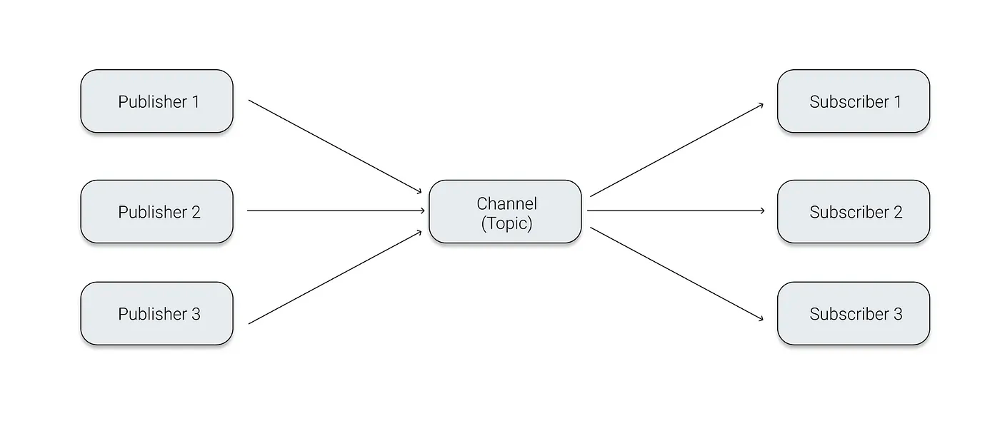
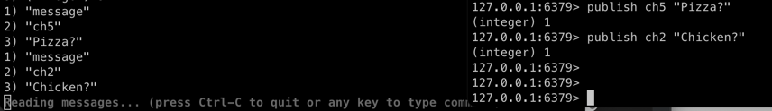
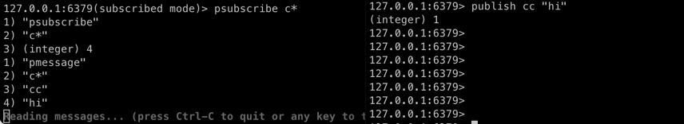
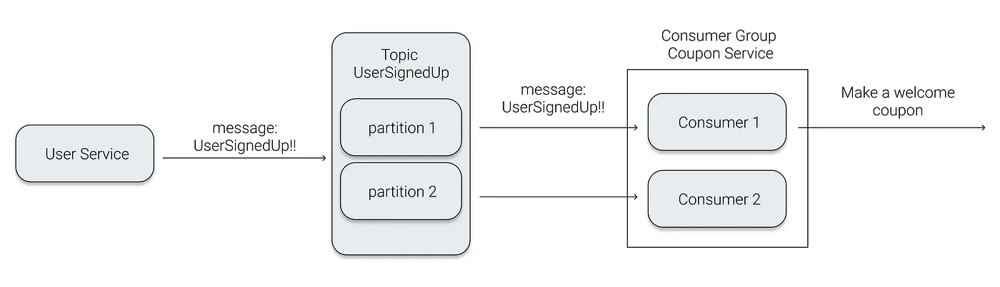
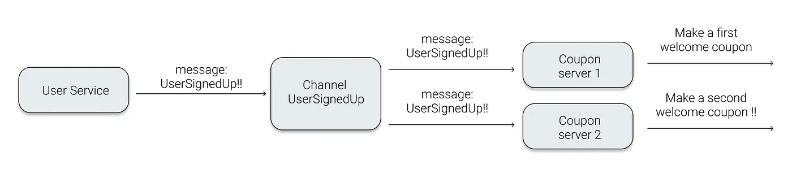

## Redis Publish / Subscribe
- Publish / Subscribe 란 특정한 주제(topic)에 대하여 해당 topic을 구독한 모두에게 메시지를 발행하는 통신 방법이다.
- 하나의 Client가 메세지를 Publish하면, 이 Topic에 연결되어 있는 다수의 클라이언트가 메세지를 받을 수 있는 구조



- Redis 클라이언트는 Redis 서버내 "채널"을 생성함
- 메시지를 수신하고 싶은 클라이언트는 사전에 해당 채널을 subscribe 한다.
- 메시지를 보내는 클라이언트는 해당 채널에 메시지를 publish할 수 있다.
- 메시지를 보내는 클라이언트가 메시지를 publish하면, subscribe 중인 클라이언트만 메시지를 수신한다.

```bash
127.0.0.1:6379> subscribe ch1
1) "subscribe"
2) "ch1"
3) (integer) 1

127.0.0.1:6379(subscribed mode)> subscribe ch2
1) "subscribe"
2) "ch2"
3) (integer) 2

127.0.0.1:6379(subscribed mode)> subscribe ch5
1) "subscribe"
2) "ch5"
3) (integer) 3

127.0.0.1:6379> pubsub channels
1) "ch2"
2) "ch5"
3) "ch1"

127.0.0.1:6379> pubsub numsub ch5
1) "ch5"
2) (integer) 1
```




## Sharded Pub/Sub
- Redis 7에서 도입되었으며, Redis Cluster 에서의 PubSub의 단점을 해결할 수 있다.
- 특정 channel에 메시지가 publish되면 요청을 받은 레디스 서버는 모든 노드에게 동일한 메시지를 publish하기 때문에 레디스 클러스터에서 Pub/Sub는 아무 노드에서나 subsribe, publish를 해도 동일하게 동작한다.
  - A노드만 subscribe 중인 B라는 채널이 있고 마스터가 10대인 경우, 의미없는 9대의 서버에도 모두 메시지를 전달해야 한다.
- 특정 노드에만 해당 채널의 정보를 publish해서 broadcast를 줄이고, 실제 부하를 줄여보자!


## KAFKA vs REDIS
1. 이벤트의 저장 여부
- Kafka는 발행된 이벤트가 각 Partition에 저장 된다. 
- 하지만 Redis는 발행된 이벤트를 저장하지 않는다.
  - 구독자가 없다면 해당 이벤트는 사라진다. 따라서, 이벤트의 구독과 발행이 실시간으로 이루어져야 되는 상황인지, 혹은 언제든 발행된 이벤트를 읽으면 되는 상황인지에 따라 선택이 달라질 것이다.
  - Redis의 Channel은 말 그대로, TV의 Channel을 생각하면 된다. 하루 종일 TV에서는 수백 개의 채널에서 방송이 방영된다. 각 방송사(Publisher)에서 방영하는 라이브 방송은, 해당 채널을 시청 중일 때만 볼 수 있다. 또한 같은 시간대에 같은 채널의 시청자(Subscriber)들은 모두 같은 방송을 볼 수 있다.  

2. 한 이벤트를 받을 수 있는 Subscriber(Consumer) 개수
- 2개의 Coupon 서비스가 존재하고, 회원 가입 이벤트를 구독하고 있는 상황
  - 회원 가입 이벤트를 Subscribe(Consume)하면 회원 가입 기념 쿠폰을 발행한다.




[//]: # (- 특정 플러그인을 Gateway로부터 서버 부팅될 때 가져다가 사용하는 상황)

[//]: # (![img_5.png]&#40;img_5.png&#41;)

[//]: # (![img_6.png]&#40;img_6.png&#41;)
