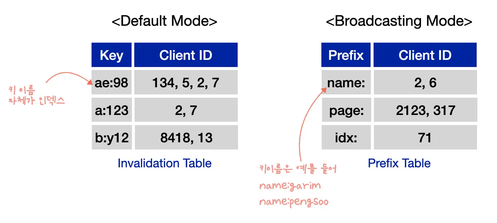
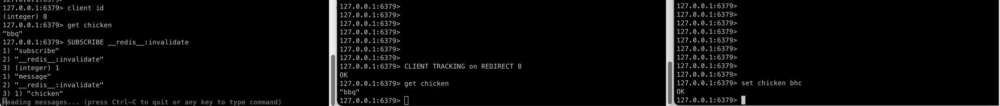

## Client-side-caching
- 어플리케이션 서버는 다이어그램에서와 같이 데이터베이스에 요청한다.

```
+-------------+                                +----------+
|             | ------- GET user:1234 -------> |          |
| Application |                                | Database |
|             | <---- username = Alice ------- |          |
+-------------+                                +----------+

```

- 클라이언트 사이드 캐싱을 사용하면, 어플리케이션은 자주 사용되는 쿼리의 응답을 어플리케이션 메모리 내에 직접 저장하여, 나중에 데이터베이스에 다시 쿼리하지 않고 응답을 재사용할 수 있도록 한다.
- 동일하고 작은 데이터를 자주 가져오는 패턴에서는 데이터를 가져오기 위한 시간을 크게 줄여줌과 동시에, 데이터베이스의 부하도 줄일 수 있다.
```
+-------------+                                +----------+
|             |                                |          |
| Application |       ( No chat needed )       | Database |
|             |                                |          |
+-------------+                                +----------+
| Local cache |
|             |
| user:1234 = |
| username    |
| Alice       |
+-------------+

```

---
## Invalidate Cache
- user:1234라는 key를 캐싱했을때, Alice라는 이름이 Flora로 업데이트 한다고 하자. 
  - 특별한 조치가 없다면 어플리케이션은 한동안 1234라는 유저의 이름을 Alice로 저장하고 있을 것이다.

- 레디스 클라이언트 사이드 캐싱은 트래킹(tracking) 이라 불리며, 두 가지 모드를 가진다.

### 1. default mode
- 서버는 클라이언트가 액세스한 키를 기억하며, 동일한 키가 수정될 때 무효 메시지를 전송한다.
```
Client 1 -> Server: CLIENT TRACKING ON
Client 1 -> Server: GET foo

서버는 Client 1이 foo라는 키를 캐시했다는 것을 기억한다.
클라이언트 1은 foo의 값이 로컬 메모리에 저장되었다는 것을 기억한다.

Client 2 -> Server: SET foo SomeOtherValue
Server -> Client 1: INVALIDATE “foo”
```
- 저장하는 key와 클라이언트 수가 많아질수록 서버에 저장하는 정보가 너무 많아진다.

### Invalidate Table
- default mode에서 레디스 서버는 어떤 클라이언트가 어떤 키를 저장하고 있는지를 기억하는 Invalidation Table을 생성한다.
- 한 클라이언트에서 여기에 저장된 키를 변경하면 레디스는 그 키를 저장하고 있는 다른 클라이언트 모두에게 캐싱된 값을 삭제하라는 메시지를 보낸다.
- Invalidation Table이 메모리를 과도하게 사용하지 않도록 레디스 6에서는 tracking-table-max-keys 라는 파라미터를 도입해 테이블에 저장가능한 최대 키의 개수를 제한한다.
  - default는 백만개




### 2. broadcasting mode
- 서버는 특정 클라이언트가 액세스한 키를 기억하려고 시도하지 않으므로 서버측에서 메모리 비용이 전혀 들지 않는다. 
  - 서버는 invalidation 테이블에 아무것도 저장하지 않는다. 대신 **Prefixes Table**에 프리픽스를 사용하는 클라이언트 목록을 저장한다.
- 대신 클라이언트는 object:, user: 와 같은 프리픽스를 구독하며, 해당 프리픽스와 일치하는 키가 변경될 때마다 메시지를 받는다.
- 서버는 주어진 프리픽스에 가입한 모든 클라이언트에 대해 단일 회신을 보내지 않고 모든 클라이언트에게 동일한 회신을 함으로 CPU 사용량을 낮출 수 있다.

<br><br>

## Two connections mode
- 레디스 6에서 지원하는 레디스 프로토콜 RESP3을 사용하면 동일한 커넥션으로 데이터 쿼리를 실행하면서 동시에 무효화 메시지를 수신할 수 있다.
  - RESP2, RESP3 프로토콜에서는 두 개의 커넥션을 이용해 데이터용 커넥션, 무효화 커넥션을 분리할 수 있다.
  - `__redis__:invalidate` 는 한 노드에서 삭제되거나 만료된 키에 대한 정보가 publish되는 채널이다.
  - Pub/Sub 채널에 가입된 모든 클라이언트가 수신하는 것이 아니라, client command로 지정한 커넥만이 실제로 pub/sub 메시지를 수신한다.
 

<br><br>

## Opt-in caching
- 클라이언트는 선택한 키만 캐시하길 원할 수 있으며, 서버에게 어떤 키를 캐시하고싶은지, 아닌지 명시할 수 있다.
- `OPTIN` 옵션을 활용하면 서버가 저장해야 하는 데이터의 양도 줄일 수 있고, 클라이언트가 수신하는 invalidate 메시지의 양도 줄일 수 있다.

```
CLIENT TRACKING on REDIRECT 1234 OPTIN
```
- Redis에 저장된 데이터에 대한 읽기 쿼리가 실행될 때, 해당 데이터는 자동으로 캐싱되지 않는다.
- 클라이언트가 무언가를 캐시하려면 실제 명령 직전에 특수 커맨드를 입력해야 한다.

```
CACHING NOREPLY
GET foo
"bar"
```

<br><br>

## The NOLOOP option
- Redis는 키를 수정한 클라이언트에게도 무효 메시지를 보낸다.
- 이 옵션을 통해 클라이언트는 불필요한 무효화 메시지를 받지 않게 되어, 로컬 캐시 관리의 효율성을 높일 수 있다.

<br><br>

## Avoiding race conditions
- 앞서 언급한 **Two connections mode**를 이용할 경우 발생할 수 있는 문제
```
[D] client -> server: GET foo
[I] server -> client: Invalidate foo (somebody else touched it)
[D] server -> client: "bar" (the reply of "GET foo")
```
- GET에 대한 응답이 지연되어 invalidate한 이전의 값을 전달받은 상황이다.
- 이 문제를 방지하기 위해 커맨드를 보낼 때 캐시를 덧붙일 수 있다.


```
Client cache: set the local copy of "foo" to "caching-in-progress"
[D] client-> server: GET foo.
[I] server -> client: Invalidate foo (somebody else touched it)
Client cache: delete "foo" from the local cache.
[D] server -> client: "bar" (the reply of "GET foo")
Client cache: don't set "bar" since the entry for "foo" is missing.
```
- 클라이언트는 "foo" 키에 대한 로컬 캐시 항목이 이미 삭제되었기 때문에 "bar" 값을 로컬 캐시에 저장하지 않는다.
- 이는 무효화 메시지로 인해 "foo"에 대한 로컬 캐시가 더 이상 유효하지 않다고 간주하기 때문이다.

<br><br>

## What to do when losing connection with the server
- 무효화 메시지를 얻기 위해 사용하는 소켓과의 연결이 끊기면 오래된 데이터로 남을 수도 있다.
  - 커넥션이 끊기면 캐시 데이터를 삭제한다.
  - 무효화 채널을 주기적으로 ping한다. 응답을 받을 수 없는 경우 캐시 데이터를 삭제한다.

<br><br>

## Limiting the amount of memory used by Redis
- 각 로컬에 저장하는 키에 TTL을 설정
- broadcast 모드를 사용하는 방법


