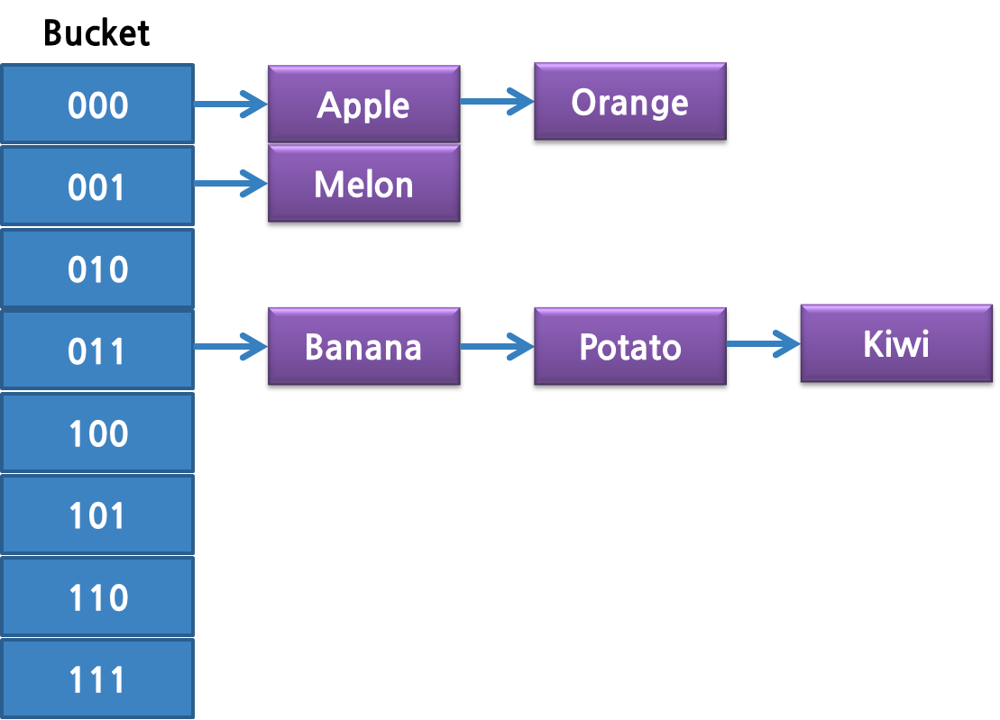

# Keyspace
- Redis key는 binary safe하다.
  - String 뿐만 아니라 JPEG File이나 Empty String도 key가 될 수 있다.

- Key에 할당 가능한 최대 크기는 512MB다.
- key의 길이가 너무 길거나 짧은 것은 권장하지 않는다.
  - 길이가 매우 긴 경우 메모리를 많이 잡아먹고, key를 찾는 작업의 cost가 증가한다.
    - SHA1 등으로 해싱한 값을 이용하는 것을 추천한다.  
    
  - 길이가 매우 짧은 경우
    - key의 가독성이 떨어질 수 있다.

  - schema에 충실한 이름을 지어주자. object-type:id
    - ex) user:1000


## Altering and querying

```
127.0.0.1:6379> set chicken bbq
OK

127.0.0.1:6379> type chicken
string

127.0.0.1:6379> exists chicken
(integer) 1

127.0.0.1:6379> del chicken
(integer) 1

127.0.0.1:6379> exists chicken
(integer) 0
```

## Key expiration
- redis는 메모리라는 한정된 데이터를 사용하기 때문에 만료일을 지정하여 데이터가 지워질 수 있도록 관리해야 한다.
- 만료 시간은 밀리초 단위까지 설정할 수 있다.
- 만료 시간은 디스크에 저장되어, 서버가 중지된 상태에서도 시간이 흐르는 것 처럼 동작한다.
  - 서버가 중지되었다가 다시 시작될 때, 레디스가 마지막으로 중지된 시간과 현재 시간을 비교하여, 그 사이에 만료되어야 할 키가 있는지를 판단할 수 있다.

```
127.0.0.1:6379> set chicken bbq
OK
127.0.0.1:6379> expire chicken 10
(integer) 1
127.0.0.1:6379> get chicken
"bbq"
127.0.0.1:6379> ttl chicken
(integer) 4
127.0.0.1:6379> get chicken
(nil)
```

expire <-> persist
```
127.0.0.1:6379> expire chicken 10
(integer) 1
127.0.0.1:6379> ttl chicken
(integer) 9
127.0.0.1:6379> persist chicken
(integer) 1
127.0.0.1:6379> ttl chicken
(integer) -1
```

## 메모리 해제
- redis에서 수명이 지난 Key는 자동으로 사라진다. 하지만 실제로 메모 해제는 쉽게 일어나지 않는다. Expire된 메모리가 해제되는 시점이 3가지 경우가 있기 때문이다.
  - Expire 기간이 지난 Key에 Access 하는 경우
  - server Cron에서 실행하는 databaseCron()
    - 모든 expire 테이블을 조사 하는 것이 아닌 랜덤 샘플링을 정해진 시간동안 조사한 뒤 key를 expire
  - 메모리가 부족할 때 메모리 정책에 따라서 메모리가 확보될때 까지 삭제한다.
    - 클라이언트로부터 데이터를 수신했을 때 readQueryFromClient() 콜백 함수가 동작한다.
    - 패킷의 유효성 검사 이후 freeMemoryIfNeeded()를 호출해 redis에 설정한 최대 메모리와 현재 메모리를 비교해서 정리 작업

```
int freeMemoryIfNeeded(void) {
	...
	if (mem_used <= server.maxmemory) return REDIS_OK;
	...
	mem_tofree = mem_used - server.maxmemory;
	mem_freed = 0;
	
	while (mem_freed < mem_tofree) {
    ...
```    

## Navigating the keyspace
### keys
- 저장된 모든 Key값을 가져오는 명령어로 시간복잡도는 O(N)
- 블로킹 방식으로 동작

### scan
- 성능 문제가 존재하는 keys 명령어의 대안이 될 수 있는 명령어로, 논블로킹 방식으로 동작한다.
- cusor를 기반으로 동작하는 Iterator
- 이어지는 순회에 사용할 cursor 값과, 지정한 패턴(pattern)과 일치하는 키를 최대 지정한 개수(count)만큼 반환한다.

```
127.0.0.1:6379> scan 0
1) "6"
2)  1) "key18"
    2) "key14"
    3) "key1"
    4) "key13"
    5) "key19"
    6) "key9"
    7) "key16"
    8) "key7"
    9) "key20"
   10) "key6"
127.0.0.1:6379> scan 6
1) "31"
2)  1) "key10"
    2) "key15"
    3) "key5"
    4) "key11"
    5) "key8"
    6) "key2"
    7) "key3"
    8) "key12"
    9) "key17"
   10) "key4"
127.0.0.1:6379> scan 31
1) "0"
2) (empty array)
```

```python
import redis
r = redis.StrictRedis('localhost', port=6379)
init = 0 # cursor 값 0으로 스캔 시작
while(True):
    ret = r.scan(init)
    print init
    init = ret[0] # 이어지는 scan 명령에 사용할 cursor 값
    print ret[1]
    if (init == '0'): # 반환된 cursor 값이 0이면 스캔 종료
        break
```




- 순회하는 도중에 rehashing이 일어나게 되면 두개의 hash table이 생성되는데 이 때 두개의 hash table 모두를 탐색하게 된다. 그럴 경우에 같은 값이 중복되어 반환될 수 있다.


### count
- 모든 반복에서 반환되는 요소의 값의 크기를 제한할 수 있는 속성
- 정확히 그 개수를 보장하지 않는다. 명령에 대한 일종의 '힌트'를 의미할 뿐이다.
```
127.0.0.1:6379> scan 0 count 3
1) "28"
2) 1) "key18"
   2) "key14"
   3) "key1"
   4) "key13"
127.0.0.1:6379> scan 0 count 4
1) "28"
2) 1) "key18"
   2) "key14"
   3) "key1"
   4) "key13"
```

### match
- key를 *와 ?를 이용한 필터링 검색 
- where 조건처럼 필터해서 가지고 오는 방식이 아니라 모든 데이터를 가지고 온 뒤 반환하기 직전에 값을 필터링해서 제공한다.


#### REF
> - https://tech.kakao.com/2016/03/11/redis-scan/
> - https://knight76.tistory.com/entry/redis-keys-%EB%8C%80%EC%8B%A0-scan
