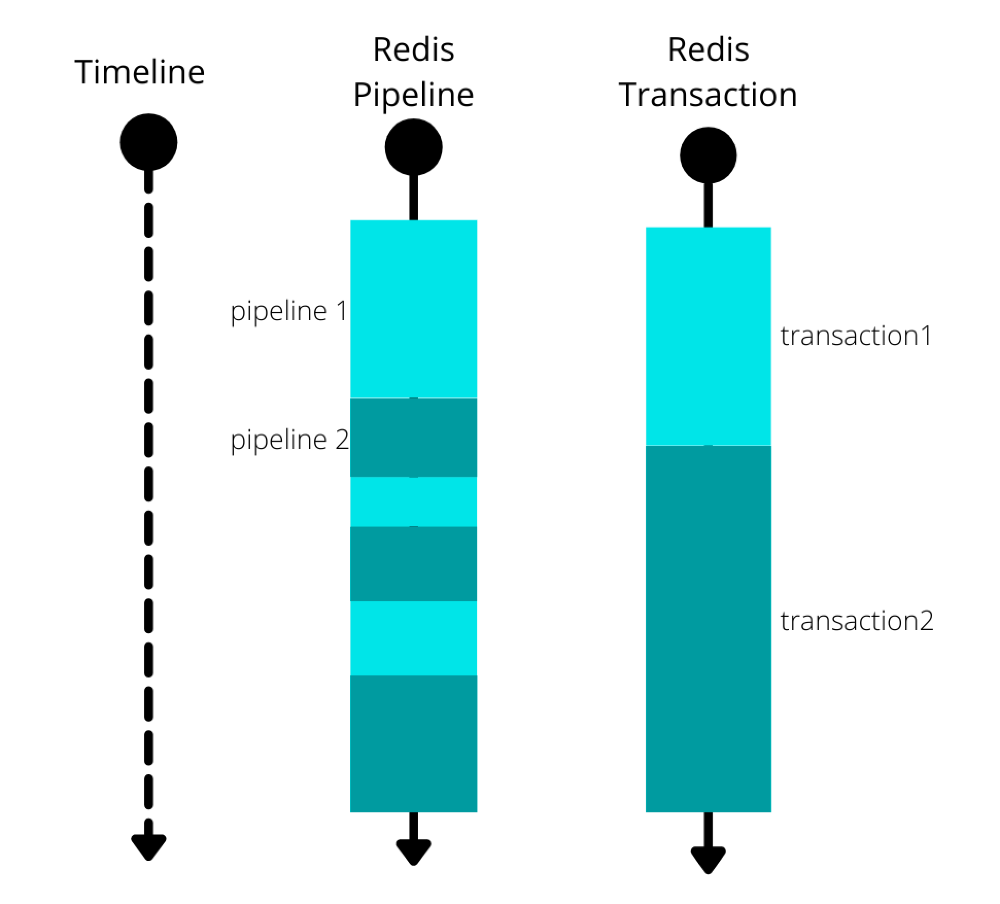

# Pipelining
- RTT(Round Trip Times) 비용을 줄여 네트워크 I/O 병목을 줄이는 명령


## Problem

```
127.0.0.1:6379> set a 1
OK
127.0.0.1:6379> incr a
(integer) 2
127.0.0.1:6379> incr a
(integer) 3
127.0.0.1:6379> incr a
(integer) 4
127.0.0.1:6379> incr a
(integer) 5
```

- 위의 작업은 총 incr command마다 request/response가 1회 발생한다.
- 일반적으로 클라이언트는 request를 보내고 서버의 response에 blocking 된다.
- 서버와 클라이언트 사이에 홉이 많다면 RTT는 증가한다.
- 커넥션 풀을 사용하는 것이 아니라면 매 요청마다 3-way-handshake가 필요하다.
  - Redis 클라이언트는 Redis 서버가 열고있는 6379 포트에 TCP로 접속한다.

## Solve
- Pipelining을 이용하면 클라이언트는 서버의 응답에 blocking 되지 않고, 새로운 요청을 전송할 수 있다. 
- 서버는 모든 요청을 받은 후 한번에 요청을 읽는다.
- 클라이언트 입장에서는 함수 콜이 줄어들고, 서버 입장에서도 I/O가 적게 발생하는 것
  - 여러개의 command가 한 번의 read, write 시스템 콜로 처리된다.
  - context switching 비용을 아낄 수 있음

```
127.0.0.1:6379> set a 1
OK
127.0.0.1:6379> incr a
127.0.0.1:6379> incr a
127.0.0.1:6379> incr a
127.0.0.1:6379> incr a

(integer) 2
(integer) 3
(integer) 4
(integer) 5
```

## Trade off
- 요청과 응답의 횟수를 줄여서 RTT 문제를 회피할 수 있다. 대신, 응답도 모아서 보내기 때문에 응답을 저장하기 위해서 더 많은 메모리가 필요하다.


### Tx vs Pipelining
- Atomic
  - Transaction은 Atomic 하다.
  - Pipelining은 Atomic 하지 않다.

- 트랜잭션의 multi/exec 사이에 존재하는 명령어들은 다른 클라이언트가 명령을 실행하지 않도록 보장된다.
- pipeline으로 처리하는 동안에는 다른 클라이언트의 작업을 처리할 수 있다.


