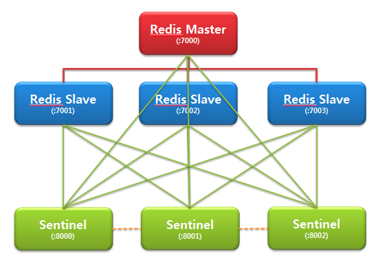

# High availability with Redis Sentinel

일반적으로 운영환경에서는 마스터와 복제로 구성된다.
운영 중 예기치 않은 이슈로 마스터가 다운되면, 서버 담당자는 복제를 마스터로 올리고 클라이언트가 새로운 마스터에 접속할 수 있도록 해야 한다.
센티넬은 마스터와 복제서버의 네트워크 통신이 가능한지 시도하고 있다가, 마스터에서 통신이 되지 않으면 자동으로 복제를 마스터로 승격한다.

## 센티넬의 기능
1. Monitoring
- 센티넬은 마스터, 복제서버가 제대로 동작하고 있는지 주기적으로 검사한다.

2. Notification 
- Failover 되었을 때 관리자에게 이메일이나 문자로 알림을 전송할 수 있다.

3. Automatic failover
- 마스터가 예기치 않게 다운되었을 때 복제 서버를 마스터로 승격한다.
- 복제 서버가 여러개 있을 경우 다른 복제서버는 새로운 마스터로부터 데이터를 받을 수 있도록 재구성한다.
- 기존 마스터가 구동되는 경우 복제로 전환하여 새로운 마스터로부터 데이터를 받을 수 있도록 한다.


## Sentinel as a distributed system
- Sentinel은 단일 노드가 아니라 여러 노드가(**3개 이상의 홀수개**) 클러스터로 동작한다.
- 장애 감지의 경우, 여러 Sentinel이 협력하여 마스터가 더 이상 사용 가능하지 않다는 사실에 동의할 때 장애 감지가 수행된다.
  - 과반수 이상의 Sentinel이 "OK" 해야 비로소 그 마스터 노드는 죽은 것이고, 그때서야 Slave 노드에서 마스터 노드를 선출하게 되는 것
- 모든 Sentinel 프로세스가 단일 실패 지점(single point of failure)이 되는 것을 방지할 수 있다.

- Quorum 2 이면 적어도 2대 이상의 센티널이 마스터가 다운되었다고 인지해야 failover를 진행한다.
  - 만약 quorum 2 이고 센티널이 2대인 상황에서 센티널 1대가 다운되었다면 failover는 결코 진행되지 않는다. 최소 권장 사항은 센티널 3대, quorum 2 이다.


## Failover 감지 방법
1. SDOWN : Subjectively down(주관적 다운)
Sentinal에서 주기적으로 Master에게 보내는 PING과 INFO 명령의 응답이 3초(down-after-milliseconds 에서 설정한 값) 동안 오지 않으면 주관적 다운으로 인지
센티널 한 대에서 판단한 것으로, 주관적 다운만으로는 장애조치를 진행하지 않는다

2. ODOWN : Objectively down(객관적 다운)
설정한 quorum 이상의 Sentinal에서 해당 Master가 다운되었다고 인지하면 객관적 다운으로 인정하고 장애 조치를 진행합니다.

## Sentinel API
- Redis Sentinel은 Sentinel과 모니터링 중인 마스터 및 replica의 health check, 특정 알림 구독, 그리고 런타임에 Sentinel 구성 변경을 위한 API를 제공한다.
- 기본적으로 Sentinel은 TCP 포트 26379를 사용하며 (일반 Redis는 6379임), Redis 프로토콜을 사용하므로, redis-cli나 다른 Redis 클라이언트를 사용하여 Sentinel과 통신할 수 있다.

```
SENTINEL MASTER <master name>      # 지정된 마스터의 상태와 정보를 표시합니다.
SENTINEL MASTERS                   # 모니터링 중인 마스터 목록과 그 상태를 표시합니다.
SENTINEL MONITOR/REMOVE/SET        # Sentinel 모니터링 시작, 중단 및 구성 설정을 합니다.
SENTINEL REPLICAS <master name>    # 특정 마스터의 복제본 목록과 그 상태를 표시합니다.
SENTINEL SENTINELS <master name>   # 특정 마스터의 Sentinel 인스턴스 목록과 그 상태를 표시합니다.

SENTINEL MONITOR <name> <ip> <port> <quorum>    # 새로운 마스터를 모니터링하기 시작하도록 Sentinel에 지시합니다. 마스터의 이름, IP, 포트, 쿼럼이 필요합니다.
SENTINEL REMOVE <name>                          # 지정된 마스터를 제거합니다. 제거된 마스터는 더 이상 모니터링되지 않으며 Sentinel의 내부 상태에서 완전히 제거됩니다.
SENTINEL SET <name> [<option> <value> ...]      # 특정 마스터의 구성 매개변수를 변경하는 데 사용됩니다. 여러 옵션/값 쌍을 지정할 수 있습니다.
SENTINEL SET objects-cache-master quorum 5
```

### Sentinel 상호 연결
- Sentinel간의 통신은 주로 Redis의 Pub/Sub기능을 통하여 이루어진다. 
  - master의 `__sentinel__:hello` sentinel 전용 채널에 매 2초마다 메시지를 게시하여 자신의 존재(ip, 포트, runid)를 알린다.
- sentinel은 구독중인 `__sentinel__:hello` 채널에서 메시지를 받은후 runId를 확인한다. runId가 자신의 runId와 같을때 자신의 정보라 판단하여 메시지는 폐기되며 runId가 다르면 타 sentinel 정보를 dict에 기록을 한다.


## Failover Process
- 센티널은 1초에 한 번씩 PING을 보내서 레디스 마스터, 슬레이브, 그리고 다른 센티널들을 체크하는데, 30초(디폴트 값) 동안 응답이 없으면 해당 서버가 다운된 것으로 인지한다.
- 다운된(sdown) 서버가 **마스터**일 경우 센티널은 그 서버를 모니터링하는 다른 센티널에게 센티널 명령("SENTINEL is-master-down-by-addr <master-ip> <master-port> <current-epoch> <*>")을 보내서 그 서버가 다운되었는지 묻는다.
- 명령(질의)을 받은 다른 센티널들은 해당 마스터 서버가 다운되었는지 여부를 응답한다. 센티널는 받은 응답에 따라 그 마스터의 다운 여부를 기록한다. 자신을 포함해서 마스터가 다운되었다고 응답한 센티널 수가 쿼럼값 이상이면 센티널은 해당 마스터가 실제로 다운되었다고 판정한다(O-DOWN).
<br><br>
- 객관적 다운을 판정한 센티널은 장애조치 단계로 진입한다
  - 센티널 리더를 선출하기 위해서 다른 센티널들에게 명령("SENTINEL is-master-down-by-addr <master-ip> <master-port> <new-epoch> <runid>")을 보낸다.
  - 이번에는 1 증가시킨 new-epoch과 센티널 자신의 runid를 보낸다.
<br><br>
- 질문을 받은 센티널은 자신의 current_epoch보다 받은 req_epoch이 높으면 아래의 단계를 진행한다.
  - 자신의 current_epoch을 받은 req_epoch으로 대치하고, 로그("+new-epoch")를 남긴다.
  - 마스터의 리더를 받은 runid로 대치하고, 로그("+vote-for-leader")를 남긴다. **이것은 자신은 받은 센티널을 리더로 투표했다는 것을 의미한다**.
<br><br>
- 리더로 선출된 센티널은 새 마스터가 될 슬레이브를 선정한다
  - slave-priority 값이 적은 것
    - 기본값은 100이고, 숫자가 적을수록 우선순위가 높다.
  - slave_repl_offset 값이 큰것
    - master_repl_offset - slave_repl_offset이 현재 replication lag
  - runid가 작은 것
<br><br>
- 다른 슬레이브들이 새 마스터를 바라보도록 슬레이브마다 slaveof new-ip new-port 명령을 실행한다.
- 모든 슬레이브가 새 마스터를 바라보는 작업(slaveof)이 완료되면 센티널의 마스터, 슬레이브, 다른 센티널 정보를 갱신한다.
